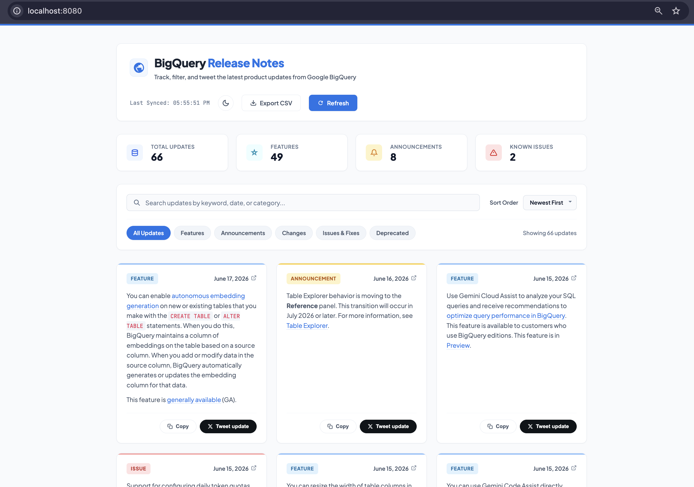

# BigQuery Release Notes Explorer

A premium, professional light-themed SaaS dashboard application built with **Python Flask** and **Vanilla HTML, CSS, and JavaScript**. 

The app automatically fetches the official Google BigQuery Release Notes RSS/Atom feed, parses and groups individual updates by their category, displays them in a clean professional light-themed dashboard, and allows developers to customize and tweet about specific updates.

---

## Developed via Google's Antigravity CLI 🚀

> [!IMPORTANT]
> This entire project was built using **Google's Antigravity CLI (`agy`)** as part of the **Kaggle x Google Day-2 workshop on Agents & Vibe Coding**.

### What is Antigravity CLI?
**Antigravity CLI (`agy`)** is Google's advanced, autonomous AI developer agent companion designed for software engineering. Running directly on the local terminal, `agy` integrates a powerful Gemini reasoning model with deep filesystem, shell command, browser automation, and subagent orchestration tools. This allows the developer to collaborate on codebase creation, modification, debugging, and testing entirely via natural language prompts, while the CLI autonomously compiles code, resolves errors, and stages commits.

### `agy` Commands Used During Development
During the design, development, and deployment of this application, the following `agy` commands were utilized:

*   **`agy`** (or **`agy -i` / `agy --prompt-interactive`**): Used to initiate the interactive developer agent session inside the repository workspace, launching the pair-programming loop.
*   **`agy --continue`** (or **`agy -c`**): Used to resume and continue the most recent coding conversation session, allowing the agent to persist context across terminals and system restarts.
*   **`agy models`**: Used to query and list the available Google Gemini models that can power the developer agent.
*   **`agy plugin`** (or **`agy plugins`**): Used to view, enable, and manage developer agent extensions (such as `chrome-devtools-plugin` for accessibility/LCP auditing and `modern-web-guidance-plugin` for CSS/JS guidelines).

### Built With
*   **Agentic Orchestrator**: Google's Antigravity CLI (`agy`)
*   **AI Foundation Model**: Gemini 3.5 Flash
*   **Backend Framework**: Python Flask (with `feedparser` and `BeautifulSoup4`)
*   **Frontend Stack**: Vanilla HTML5, Vanilla CSS3, and Vanilla ES6 JavaScript (built completely from scratch without external frameworks or UI libraries)

---

## Preview



---

## Key Features

- **Professional Light UI**: A clean, distraction-free interface matching premium Google Cloud documentation styling.
- **Vibrant Stats Dashboard**: A statistics card panel indicating active metrics (Total Updates, Features, Announcements, and Issues) computed dynamically as data updates.
- **Smart HTML Update Splitting**: BigQuery publishes all daily updates grouped in a single XML feed item. The backend parses this HTML and splits it by `<h3>` category headings to present distinct, selectable updates.
- **Color-Coded Pastel Badges**: Updates are color-coded by type (Blue for Features, Yellow for Announcements, Red for Issues, Green for Changes).
- **Interactive Search & Category Filters**: Live-filter updates using the search bar or category navigation pills. Order results dynamically by newest or oldest first.
- **Mock X (Twitter) Draft Composer**:
  - Automatically generates engaging tweets: `Google #BigQuery [Type] ([Date]): "[Content]" [Link]`
  - Smart word-boundary truncation keeping draft elements within X's 280-character limit.
  - Features an interactive character counter and a radial SVG progress circle indicating remaining length.
  - Confirms and redirects to the official `x.com` sharing intent interface.
- **Direct Anchor Links**: Link icons point directly to the date's specific anchor location on the Google Cloud release page (e.g. `#June_17_2026`).
- **Resilient Fallback Parsing**: Bypasses macOS certificate verification restrictions dynamically and implements an in-memory cache to maintain server performance.

---

## File Structure

```text
bigquery-release-notes-app/
├── app.py                  # Flask Application Server (API + HTML Routes)
├── templates/
│   └── index.html          # Clean HTML5 Template Structure
├── static/
│   ├── css/
│   │   └── style.css       # Custom Light Theme Styles & Transitions
│   └── js/
│       └── app.js          # Client-Side Rendering, Filtering & Share Logic
├── .gitignore              # Git Ignore Exclusions (Virtualenv, Caches, etc.)
└── README.md               # Project Documentation
```

---

## Quick Start & Running

### Prerequisites
Make sure you have **Python 3.12** or higher installed.

### Installation

1. Navigate to the project root directory:
   ```bash
   cd bigquery-release-notes-app
   ```

2. Create a Python virtual environment:
   ```bash
   python3 -m venv .venv
   ```

3. Activate the virtual environment:
   - On macOS/Linux:
     ```bash
     source .venv/bin/activate
     ```
   - On Windows:
     ```bash
     .venv\Scripts\activate
     ```

4. Install the required dependencies:
   ```bash
   pip install Flask requests feedparser beautifulsoup4
   ```

### Running the Server

Start the Flask application:
```bash
python app.py
```

The application will launch on port `8080`. Open your browser and navigate to:
👉 **[http://localhost:8080/](http://localhost:8080/)**

---

## Dependencies

- **[Flask](https://flask.palletsprojects.com/)**: Micro-web framework to serve endpoints and assets.
- **[BeautifulSoup4](https://www.crummy.com/software/BeautifulSoup/)**: HTML parsing to extract individual updates.
- **[Feedparser](https://github.com/kurtmckee/feedparser)**: Atom/RSS feed parser.
- **[Requests](https://requests.readthedocs.io/)**: Fallback HTTP client for network fetch requests.
